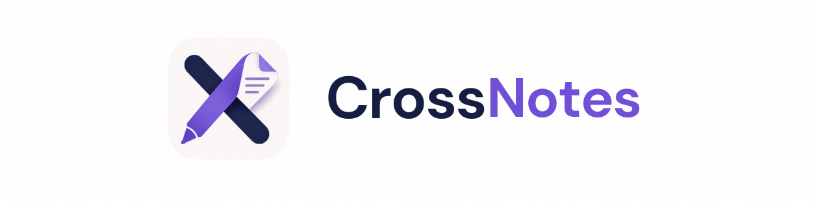

<div align="center">



### Next-Generation Cross-Platform Digital Note-Taking

*A high-performance, intelligent note-taking ecosystem bridging Mac and Android with ultra-low latency native rendering and seamless device synchronization.*

<br/>

<!-- Tech Stack Badges -->


</div>

---

## 🚀 Overview

**CrossNotes** completely reimagines the digital notebook by combining raw, native-level drawing performance with robust cross-device synchronization. Built entirely from scratch using custom Turbo Modules and a bespoke gesture interceptor, it delivers a fluid, paper-like experience on Android tablets while staying instantly connected to your Mac.

## ✨ Key Features

### 🖌️ Native Drawing Engine
- **Zero-Latency Inking:** Bypasses the React Native bridge entirely by using custom Kotlin/Swift Native Views to draw directly onto the hardware canvas.
- **Hardware Stylus Support:** Deep integration with Android S-Pen and standard styluses.
- **Auto-Eraser:** Simply hold the stylus button to instantly switch to the eraser mode via native motion event listeners.

### 🔄 Magic Mac-to-Tablet Transfer
- **Live Transfer Station:** Includes a standalone Vite/React web application running on your Mac.
- **Drag & Drop:** Instantly transfer images and text from your Mac to your tablet canvas over a high-speed local Socket.io connection.
- **No Manual Pasting:** Dropped images magically beam onto the exact active page on your tablet in real-time.

### ✋ Advanced Gesture Isolation Engine
- **Focal Zoom & Pan:** Smooth, 60fps pinch-to-zoom and two-finger panning powered by Reanimated 3.
- **Interactive Overlays:** Images and text pasted onto the canvas are first-class interactive citizens.
- **Gesture Hijacking:** Selecting an image dynamically hijacks swipe and pinch gestures, allowing you to resize and rotate the image *without* moving the paper underneath.

### 📝 Dynamic Template System
Switch your paper on the fly with a beautiful modal selection system, featuring fully scalable, infinitely redrawn procedural templates:
- **Ruled** (Standard, Semi, Narrow, College, School)
- **Grid** (Standard, Narrow, Fine Engineering)
- **Blank**

## 🏗️ Architecture

CrossNotes operates as a dual-architecture ecosystem:
1. **The Android Application (Expo/React Native)**: Handles the UI, state, and complex Reanimated gesture chains.
2. **The Custom Native Module (Kotlin/Swift)**: Exposes a `MyModuleView` that renders the ink paths using native `Canvas` and `Paint` APIs to guarantee 120Hz tracking.
3. **The Mac Transfer Station (Node.js/Vite)**: A lightweight local WebSocket server that listens for drag-and-drop events and broadcasts payloads directly to the tablet.

## 🛠️ Getting Started

### 1. Start the Mac Transfer Station
```bash
cd goodnotes-mac-transfer
npm install
node server.js & npm run dev
```
*Note the local IP address displayed in the terminal!*

### 2. Start the CrossNotes Tablet App
```bash
cd goodnotes-clone
npx expo start
```
*Tap the 'Sync' icon in the top right corner of the app and enter the Mac's IP address to establish the realtime connection.*

---

<div align="center">
  &copy; 2026 Deep Bartaria (<a href="https://github.com/DeepBartaria">github.com/DeepBartaria</a>). All Rights Reserved.
</div>
